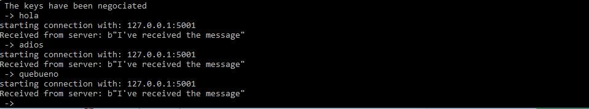

# Shallot network

## Prerequistes

- python 3 (Anaconda 5.0.1)
- pycrypto library (pip install pycrypto)

## How to run

Open a consoloe and go to the project folder. You will have two folder
>shallot/src  
>shallot/config

Inside `shallot/config` you will have the ini files
> host.ini  
> topology.ini

To run the project you have to go to the `shallot/src` folder, you will have one folder `classes` and three files
> `alice.py`  
> `bob.py`  
> `relay_network.py`  

1. You have to run `bob.py`
    > python bob.py
2. You have to run `relay_network.py`
    > python relay_network
3. You have to run `alice.py`
    > python alice.py

`note:` you have to open one `terminal` for `bob`, other for `relay_network` and other for `alice`.

# Alice

In alice terminal you can write the message you want to send to bob, each time bob receive the message he will response to alice with a aknowledge message then alice can send other message.

